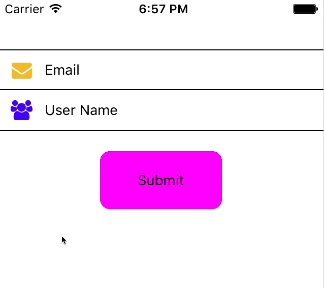

# rn-input-row
<a href="https://npmjs.org/package/rn-input-row"></a>




- This is a HIGHLY customizable ANIMATED input row for React-Native.

- Good for single line form inputs.

##### Requires react-native-vector-icons/FontAwesome
###### All Icon Names are the Font Awesome available options

- There are are built in default values, but you can change just about anything.

```js
npm install rn-input-row --save
npm install react-native-vector-icons --save
react-native link
```

Two required props `height` and `renderTextInput`, but they won't take you far on their own.

The input row is broken into 4 containers.
You have to declare what containers to render.

```js
.
  renderLeftIcon={true} // has a flex of 1 by default
  renderTitle={true}  //  has a flex of 2 by default
  renderTextInput={true} // has a flex of 3 by default.   Make sure to include onChangeText function with this!!
  renderRightIcon={true} // has a flex of 1 by default
```

then customize them

```js
.
  leftIconName={'envelope'}
  leftIconColor={'rgb(229, 179, 60)'}
```


```js
import React, { Component } from 'react';
import { View, TextInput, TouchableOpacity, Text } from 'react-native';
import InputRow from 'rn-input-row';
import dismissKeyboard from 'react-native/Libraries/Utilities/dismissKeyboard';


export default class Example extends Component {

  constructor(){
    super();
    this.state={

    }
  };

  render(){
    return(
      <View style={{paddingTop:50}}>
        <InputRow
          height={40}
          renderLeftIcon={true}
          renderTitle={true}
          renderTextInput={true}
          renderRightIcon={true}
          title={'Email'}
          validate={'email'}
          errorMessage={'Please enter an email address'}
          leftIconName={'envelope'}
          leftIconColor={'rgb(229, 179, 60)'}
          onChangeText={
            (text) => console.log(text)
          }
          isValid={
            (bool) => console.log(bool)
          }
          containerStyle={{
            borderTopWidth:1,
            borderBottomWidth:1,
          }}
        />
        <InputRow
          height={40}
          renderLeftIcon={true}
          renderTitle={true}
          renderTextInput={true}
          renderRightIcon={true}
          title={'User Name'}
          validate={
            (text) => {
              if (text.length >=8) {
                return true
              } else {
                return false
              }
            }
          }
          errorMessage={'User Name must be 8 characters'}
          leftIconName={'users'}
          leftIconColor={'blue'}
          onChangeText={
            (text) => console.log(text)
          }
          isValid={
            (bool) => console.log(bool)
          }
          containerStyle={{
            borderBottomWidth:1,
          }}
        />


        // Here is a "trick" I use to force the blur to call the validations
        // I just dismissKeyboard
        // I like calling the validation onBlur because it shows the activity icons when focused

        <TouchableOpacity
          onPress={
            () => dismissKeyboard()
          }
          style={{
            marginTop:20,
            marginHorizontal: 100,
            borderRadius:10,
            backgroundColor: 'magenta',
            alignItems:'center',
            justifyContent:'center',
            padding:20
          }}>
          <Text>Submit</Text>
        </TouchableOpacity>

      </View>
    )
  };

};

```

##### You can pass in validations.
- Validations must be a function that `returns` `true` or `false` or one of the validations I defined

```js
  validate={
    (text) => {
      if (text.length > 8) {
        return true
      } else {
        return false
      }
    }
  }
```
- Right now I have `email`, `zip`, and `currency` as options.  I will add more If I need more for my projects

```js
  validate={'email'}
```

### Props

| Prop  |  Type  |  Description  | Required |
| ---   |  ---   |  ---          | --- |
| height | number | height of the container | **YES** |
| renderTextInput | boolean  | render the text input | **YES** |
| renderLeftIcon | boolean | render the left icon | suggested |
| renderTitle | boolean | render the title | suggested |
| renderRightIcon | boolean | render the right icon | suggested |
|||
| containerStyle | object | styles applied to the container | no |
| rightIconSize | number | size of the rightSide icon (default-20) | no |
| rightContainerFlex | number | flex of the right side icon container (default-1) | no |
| validIconName | string (FontAwesome Icon name) | what icon to render if valid input (default-check) | no |
| validIconColor | string | color of the valid icon (default-green) | no |
| validIconSource | require('../Folder/file.ext') | optionally supply your own icon as the valid icon | no |
| validIconStyle | object | styles applied to the icon you supply, only used with the above prop| no |
| invalidIconName |string (FontAwesome Icon name) | what icon to render if inValid input (default-close...an X) | no |
| invalidIconColor | string | color of the inValid icon (default-red) | no |
| activeIconName | string (FontAwesome Icon name) | there are three icons that animate when the input is focused (default-circle)| no |
| activeIconColor | string | color of the active icons (default-black) | no |
|activeIconSize | number | size of the active icons (default-6) | no |
| leftIconSize | number | size of the left icon (default-20) | no |
| leftContainerFlex | number | flex of the left side icon container (default-1)| no |
| leftIconName | string (FontAwesome Icon name) | what icon to render on left side of container | no |
| leftIconColor | string | the color of the icon on the left side | no |
| leftIconSource | require('../Folder/file.ext') | optionally supply your own icon as the left icon |  no |
| leftIconStyle | object | styles applied to the icon you supply, only used with the above prop| no |
| title | string | what text to display in title container | no |
| titleContainerFlex | number | flex of the title container (default-2) | no |
| titleTextStyle | object | styles applied to the title text | no |
| text | string | the text for the text input | no |
| placeholder | string | same as TextInput | no |
| placeholderTextColor | string | same as TextInput | no |
| secureTextEntry | boolean | same as TextInput | no |
| keyboardType | string | same as TextInput | no |
| underlineColorAndroid | string | same as TextInput | no |
| editable | boolean | wether the text input is editable (default-true) | no |
| onChangeText | function  | just like TextInput function | if editable is true |
| textInputStyle | object | styles applied to the text of the text input | no |
| onFocus | function | called when text input is focused | no |
| textContainerFlex | number | flex of the text input container (default-3) | no |
|validate | 'email','zip','currency', or function | what to validate.  If you supply a function it takes in the text as the argument and **MUST** return true or false| no |
|isValid | function | function called when input loses focus and returns true or false | no |
| errorMessage | string | what message to display when the input does not pass the validation | no |
| errorOffset | number | how much should the container grow when there is an error (default-10) | no |
| errorTextStyle | object | styles to apply to the error text (default {color:'red',fontSize:10}) | no |
| onLayout | function | function called on outermost container layout | no |
| isButton | boolean | (default-false) when true, the input row can be used as a button, validIcon will be the right side icon applied, and text input is not editable | no |
| onPress | function | function called if isButton is true | if isButton is true |
| forceShowError | boolean | Force show the error message. Example, user hasn't input a value so the error hasn't shown.  This starts by not showing an error for better UX, but if no input is entered you can force show with this prop, just remember to clear it on your component side once the validation comes back | no |
