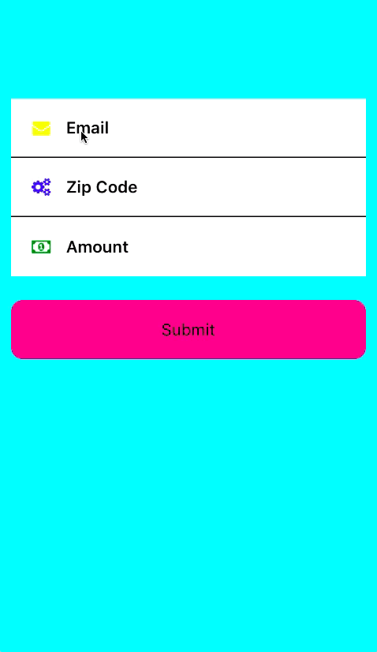

# rn-input-row
<a href="https://npmjs.org/package/rn-input-row"></a>

- This is a HIGHLY customizable ANIMATED input row for React-Native.
- It returns nothing to you, it just transfers props to the proper components supplied by RN and Animates activity and error messages
- Completely up to you how you want to use the validations, get and set values.  I do it onBlur of TextInput rather than onChangeText to avoid re-rendering on every keystroke...

### Uses react-native-vector-icons/FontAwesome as the icon source




| Prop | Type | Description | Requirements |
| ---  | ---  | ---         | ---          |
| containerProps | object | View Props | **ALWAYS REQUIRED** Must include `style` with a *height* inside the style. |
| errorProps | object | Text Props plus two custom props `render` and `text` for the error message | Must include `render` and `text` when using this prop |
| leftIconProps | object | Icon or Image props, depending on the `localIcon` prop | Must include `localIcon` when using this prop.  `localIcon:true` will transfer props to an Image component, `localIcon:false` will transfer props to `Icon` |
| titleProps | object | Text Props for the title plus `text` | Must include `text` when using this prop |
| textInputProps | object | TextInput Props for the input portion | Must include `style` when using this at least put a `{flex:1}` in style, shit...put a `flex:something` on all of them...the icons have a flex 1 for reference |
| rightIconProps | object | same as `leftIconProps` plus `renderActivity` `renderIcon` `activityIconProps` | Must use `renderActivity` `renderIcon` `localIcon` when using this.  Must use `activityIconProps` when `renderActivity` is `true` `activityIconProps` will only transfer to an `Icon`


## Validations

I have written some validations you can import and use.


## Button
`import { Button } from 'rn-input-row';`
- Must include an `onPress` in `containerProps` when usng the `Button`

I have included a `Button` component you can import and use so you can have a touchable form entry that blends seamlessly with the rest.  Structure is similar to the `InputRow`, except `textInputProps` are replaced with `detailProps` so you can have `titleProps` and `detailProps` in the same row.  The `rightIconProps` on the `Button` will be exactly like the `leftIconProps`.


```js
npm install rn-input-row --save
npm install react-native-vector-icons --save
react-native link react-native-vector-icons
```
```js
import React from 'react';
import { View, StyleSheet } from 'react-native';
import dismissKeyboard from 'react-native/Libraries/Utilities/dismissKeyboard';


import { InputRow, Button, validateEmail, validateZip, validateCurrency } from 'rn-input-row';

const activityIconProps = {name:'circle',size:6,color:'black'}

const styles = StyleSheet.create({
  container: {
    flex:1,
    backgroundColor: 'aqua',
    paddingTop:100,
  },
  rowContainer: {
    height: 50,
    backgroundColor: 'white',
    marginHorizontal:10,
    paddingHorizontal: 5,
  },
  border: {
    borderBottomWidth: 1
  },
  title: {
    fontSize: 14,
    fontWeight: '600',
    flex:2
  },
  textInput: {
    flex:3,
  },
  errorText: {
    color:'red',
    fontSize:12,
    marginLeft:12
  },
  submit: {
    height: 50,
    marginHorizontal: 10,
    marginTop:20,
    borderRadius:10,
    backgroundColor: 'deeppink',
    alignItems:'center',
    justifyContent:'center',
    padding:5
  }
})


export default class Example extends React.Component {

  constructor(){
    super();

    this.email = '';
    this.zip = '';
    this.amount = '';

    this.state = {
      email:'',
      validEmail: true,

      zip:'',
      validZip: true,

      amount: '',
      validAmount: true,

    };
  };

  updateEmail = (text) => {
    this.setState({ email:text ,validEmail: validateEmail(text) })
  };

  updateZip = (text) => {
    this.setState({ zip:text, validZip: validateZip(text) })
  };

  updateAmount = (text) => {
    this.setState({ amount:text, validAmount: validateCurrency(text) })
  };

  submit = () => {
    //this will blur inputs and allow pending validations to run.
    dismissKeyboard();

  };

  render(){
    return(
      <View style={styles.container}>
        <InputRow
          containerProps={{style:[styles.border,styles.rowContainer]}}
          errorProps={{
            render: !this.state.validEmail,
            text: 'Please enter an email address',
            style: styles.errorText
          }}
          leftIconProps={{
            localIcon: false,
            name: 'envelope',
            size: 15,
            color: 'yellow'
          }}
          titleProps={{
            text: 'Email',
            style: styles.title
          }}
          textInputProps={{
            style: styles.textInput,
            onChangeText: (text) => this.email = text,
            onBlur: () => this.updateEmail(this.email),
          }}
          rightIconProps={{
            renderActivity: true,
            renderIcon:(this.state.email === '') ? false:true,
            localIcon: false,
            name: (this.state.validEmail) ? 'check':'close',
            size:15,
            color:(this.state.validEmail) ? 'green':'red',
            activityIconProps: activityIconProps
          }}
        />
        <InputRow
          containerProps={{style:[styles.border,styles.rowContainer]}}
          errorProps={{
            render: !this.state.validZip,
            text: 'Please enter a zip code',
            style: styles.errorText
          }}
          leftIconProps={{
            localIcon: false,
            name: 'cogs',
            size: 15,
            color: 'blue'
          }}
          titleProps={{
            text: 'Zip Code',
            style: styles.title
          }}
          textInputProps={{
            style: styles.textInput,
            onChangeText: (text) => this.zip = text,
            onBlur: () => this.updateZip(this.zip),
          }}
          rightIconProps={{
            renderActivity: true,
            renderIcon:(this.state.zip === '') ? false:true,
            localIcon: false,
            name: (this.state.validZip) ? 'check':'close',
            size:15,
            color:(this.state.validZip) ? 'green':'red',
            activityIconProps: activityIconProps
          }}
        />
        <InputRow
          containerProps={{style:styles.rowContainer}}
          errorProps={{
            render: !this.state.validAmount,
            text: 'Please enter a valid amount',
            style: styles.errorText
          }}
          leftIconProps={{
            localIcon: false,
            name: 'money',
            size: 15,
            color: 'green'
          }}
          titleProps={{
            text: 'Amount',
            style: styles.title
          }}
          textInputProps={{
            style: styles.textInput,
            onChangeText: (text) => this.amount = text,
            onBlur: () => this.updateAmount(this.amount),
          }}
          rightIconProps={{
            renderActivity: true,
            renderIcon:(this.state.email === '') ? false:true,
            localIcon: false,
            name: (this.state.validAmount) ? 'check':'close',
            size:15,
            color:(this.state.validAmount) ? 'green':'red',
            activityIconProps: activityIconProps
          }}
        />

        <Button
          containerProps={{
            onPress: this.submit,
            style: [styles.rowContainer,{marginTop:10,backgroundColor:'deeppink'}]
          }}
          titleProps={{
            text: 'Submit',
            style: [styles.title,{textAlign:'center'}]
          }}
          leftIconProps={{
            localIcon:false,
            name: 'star',
            size:12,
            color: 'yellow'
          }}
          rightIconProps={{
            localIcon:false,
            name: 'star',
            size:12,
            color: 'yellow'
          }}
        />

      </View>
    )
  }
}
```
